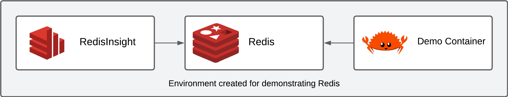

# Redis presentation

This is the accompanying repository for a presentation on Redis containing multiple demos on the features and concepts
discussed.



## How to run

- Run docker compose

```bash
docker compose up -d --build
```

_Hint: If you do not want to build the container every time you can use the following to start the environment:_

```bash
docker compose up -d --remove-orphans
```

- Connect to container

```bash
docker exec -it redis-demo fish
```

## How to use

- Use redis-cli

```bash
redis-cli -h redis
```

---

- Use RedisInsight in browser

Visit [http://localhost:5540](http://localhost:5540) in your browser and add a new connection. Make sure to use `redis`
as the hostname instead of `127.0.0.1` and keep the port on `6379`.

---

- Use demo application inside container (possible demo names: `cache`, `fibonacci_cache`, `pubsub`, `geo`, `geo_radius`)

```bash
cargo run --bin [DEMO_NAME]
```

---

The demo `fibonacci_cache` requires two arguments:

- `n` the nth number of fibonacci numbers to calculate
- `cache` wether to use the cache or not

Example:

```bash
cargo run --bin fibonacci_cache 20 true
```

---

The demos `geo` and `geo_radius` require you to run the following to import the sample data provided by OpenStreetMap:

```bash
python3 /redis_demo/sample_data/etl.py
```

---

The demo `geo` requires one argument:

- `city` the name of the city to search for

Example:

```bash
cargo run --bin geo mannheim
```

---

The demo `geo_radius` requires three arguments:

- `latitude` the latitude of the center of the radius
- `longitude` the longitude of the center of the radius
- `radius` the radius in kilometers

Example:

```bash
cargo run --bin geo_radius 49.47474553497348 8.534231778349126 3
```

---

## Useful links

- [Redis commands](https://redis.io/commands)
- [Redis cli cheatsheet](https://redis.io/topics/rediscli)
- [Redis university](https://university.redis.com/)
- [RedisInsight - GUI](https://github.com/RedisInsight/RedisInsight)

---

_OpenStreetMap® is open data, [licensed](https://www.openstreetmap.org/copyright) under the Open Data Commons Open
Database License (ODbL) by the OpenStreetMap Foundation (OSMF)._
_Redis and the cube logo are registered trademarks of Redis Ltd._