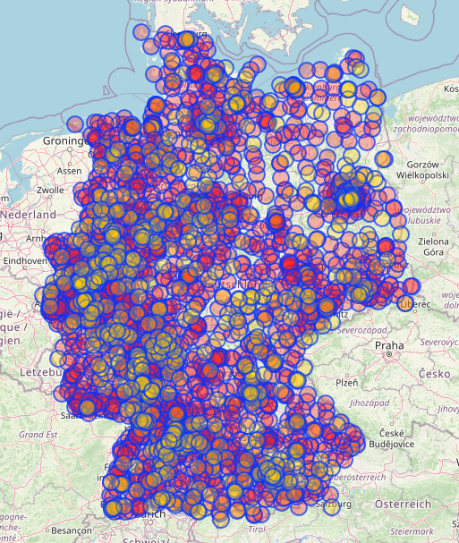

# Sample data: Lidl locations in germany

## Retrieve data

Visit [https://overpass-turbo.eu/](https://overpass-turbo.eu/) to gather the locations from OpenStreetMap.

Run the following query:

```overpass
[out:json];
area["ISO3166-1"="DE"]->.searchArea;
(
  node["shop"="supermarket"]["name"="Lidl"](area.searchArea);
  way["shop"="supermarket"]["name"="Lidl"](area.searchArea);
);
out center;
```



## Data in redis

The data of each store is stored in a hash with the key `lidl_location:<id>`, while simultaneously the location is
stored in a sorted set named `lidl_geo`. For a later demo, an index on the city is created in an unsorted set
named `lidl_index:city:<city_name>`.

## Why the index is created using a set, rather than a sorted set.

To access the data in a sorted set, the `ZRANGE` command is used. It returns the elements in the sorted set within the
specified range. The time complexity of this command is $`O(log(N)+M)`$ with $`N`$ being the number of elements in the
sorted set and $`M`$ being the number of elements returned, which is already quite good. However, in the following
demos, we will always want to access all members of the set, so $`M = N`$, effectively changing the time complexity
to $`O(log(N) + N)`$. To access all members of a set, the `SMEMBERS` command is used, which has a time complexity
of $`O(N)`$, where $`N`$ is the number of elements in the set, which is better than $`O(log(N) + N)`$.

---

_OpenStreetMap® is open data, [licensed](https://www.openstreetmap.org/copyright) under the Open Data Commons Open
Database License (ODbL) by the OpenStreetMap Foundation (OSMF)._